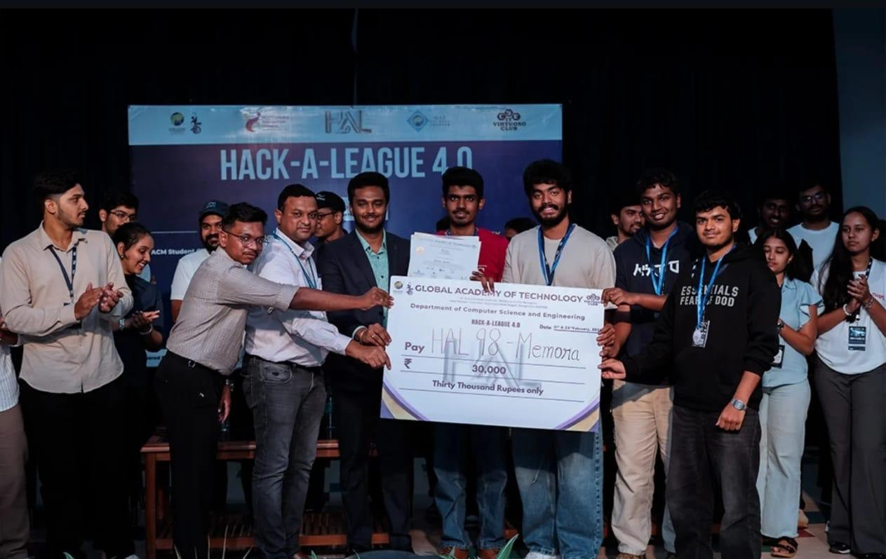
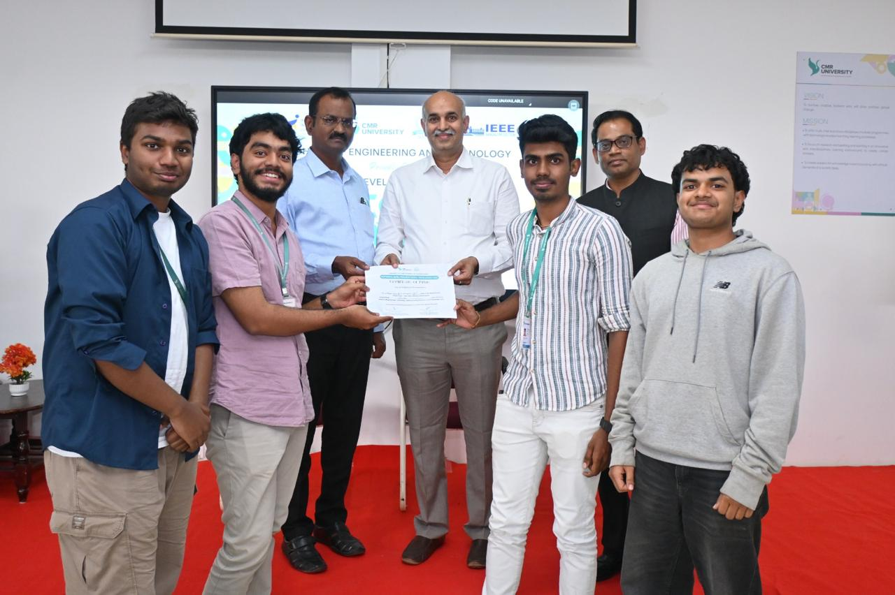

# Memora: AI Dementia Companion



<p align="center"><strong>Won 2nd place national level hacakthon organised by Global Academy of Technology</strong></p>


<p align="center"><strong>Won 3rd place national level hacakthon organised by Sai Ram College of Engineering</strong></p>



<p align="center"><strong>Won 2nd place in the national level Tech-Expo organised by CMR University</strong></p>

An AI and AR-powered companion application designed to provide comprehensive support for dementia patients, their caregivers, and their families. Memora aims to enhance the daily lives of patients by providing tools for navigation, reminders, and cognitive engagement, while keeping caregivers and family members connected and informed.

## ✨ Features

Memora is a single application with three distinct views, each tailored to a specific user.

### 🧑‍⚕️ Patient View
The primary interface for the person with dementia, designed for simplicity and ease of use.
- **Robust AR Home Navigation:** A rebuilt navigation system using the phone's camera and motion sensors. It features a compass calibration step, a stabilized AR arrow that correctly points to the destination relative to the real world, and automatic step detection.
- **AI Companion ("Digi"):** A friendly, voice-enabled AI chatbot for conversation and emotional support, powered by the Gemini API.
- **Daily Reminders:** Simple, icon-driven reminders for medications, meals, and hydration.
- **Cognitive Games:** A simple memory matching game to provide gentle mental stimulation.
- **Memory Album:** A visual album of photos and captions shared by family members.
- **Voice Messages:** A simple way to send and receive voice notes from family and caregivers.
- **Emergency SOS:** A large, prominent slider to alert caregivers and family in case of an emergency, designed to prevent accidental presses.
- **Fall Detection:** Automatically detects potential falls using the phone's accelerometer and sends an alert.

### ดูแล Caregiver View
A dashboard for professional caregivers to manage the patient's daily routine and monitor their well-being.
- **Alerts Dashboard:** Displays urgent alerts for SOS button presses and falls.
- **Schedule Management:** Add, view, and delete daily reminders for the patient.
- **Voice Mailbox:** Send and review voice messages with the patient and family.

### 👨‍👩‍👧 Family View
A portal for family members to stay connected and involved in their loved one's care.
- **Activity Timeline:** A real-time log of patient activities, such as completed reminders and shared memories.
- **Share Memories:** Easily upload photos and captions to the patient's Memory Album.
- **Send Comforting Thoughts:** Use AI to generate and send a short, uplifting quote to the patient's home screen, or write a personal one.
- **Voice Messages:** Share voice notes to stay connected personally.
- **View Schedule & Alerts:** Stay informed about the patient's daily plan and any urgent alerts.

## 🧭 How AR Navigation Works

The AR navigation system has been re-architected for accuracy and reliability.

1.  **Permissions & Calibration:** The user is first prompted to grant camera and motion sensor permissions. Then, a mandatory calibration screen guides the user to rotate their device, which helps stabilize the magnetometer (compass) for an accurate heading.
2.  **Sensor Fusion & Smoothing:** The app uses a custom `useDeviceSensors` hook that reads from the `deviceorientation` API. To prevent a jittery arrow, it applies a moving average filter to the raw compass heading, providing a smooth but responsive orientation.
3.  **Pedestrian Dead Reckoning (PDR):** Instead of manual buttons, the system uses the device's accelerometer (`devicemotion`) to automatically detect steps. A peak-detection algorithm with a lockout period ensures that steps are counted accurately.
4.  **Accurate Arrow Pointing:** The core of the system is its arrow logic. The arrow's on-screen rotation is calculated with the formula `relativeBearing = normalizeAngle(destinationBearing - deviceHeading)`. This ensures the arrow visually **rotates with the device**, while its direction always **points to the destination's real-world bearing**.
5.  **Developer Mode & Testing:** A "Dev Mode" toggle is available within the AR view. This enables a debug overlay showing live sensor data. It also allows developers to manually set a simulated device heading to easily test navigation logic, such as the "296° case" outlined below.

### Testing the "296° Case"
1.  Navigate to the AR feature on a mobile device.
2.  Enable the "Dev Mode" toggle in the header.
3.  The debug overlay will appear. The destination bearing (`B_dest`) is hardcoded to **296°**.
4.  Use the slider in the debug overlay to set the simulated heading (`H_device`) to **296°**.
5.  **Observe:** The `relative` bearing should be `0°`, and the arrow on screen should point straight up.
6.  Change the simulated heading to **206°**.
7.  **Observe:** The `relative` bearing should be `90°`, and the arrow on screen should point directly to the right.

## 🛠️ Tech Stack

- **Frontend:** React, TypeScript, Tailwind CSS
- **AI/ML:**
    - Google Gemini API (`@google/genai`) for the AI companion and quote generation.
- **Web APIs:**
    - `getUserMedia` (Camera API)
    - `DeviceOrientationEvent` & `DeviceMotionEvent` (Motion Sensors)
    - `SpeechRecognition` (Voice Input)
    - `MediaRecorder` (Audio Recording)

### Performance & Data Handling Notes
- **Audio:** To ensure performance and avoid bloating memory, audio data is handled using `Blob` objects and `URL.createObjectURL()`. **Base64 encoding is explicitly avoided for audio data** as it is inefficient. This approach is used for both recording and playback of voice messages.

## 🚀 Getting Started

Follow these instructions to get a copy of the project up and running on your local machine.

### Prerequisites

- [Node.js](https://nodejs.org/) (v18 or newer recommended)
- `npm` package manager (project scripts and docs use npm)
- A valid **Google Gemini API Key**. You can get one from [Google AI Studio](https://aistudio.google.com/app/apikey).

### Installation & Setup

1.  **Clone the repository:**
    ```bash
    git clone https://github.com/your-username/memora-app.git
    cd memora-app
    ```

2.  **Install dependencies:**
    ```bash
    npm install
    ```

3.  **Set up your environment variables (server-side AI key):**
    The Gemini key must be configured on the backend, not in the browser bundle.
    For local development with the demo server, add this in `demo-server/.env` (or your shell):
    ```
    GEMINI_API_KEY=YOUR_GEMINI_API_KEY
    ```
    Optional:
    - `GEMINI_MODEL` (defaults to `gemini-2.5-flash`)
    - `VITE_AI_API_BASE_URL` for frontend deployments where AI API is hosted on a different origin.

## 🏃 Running the Development Server

### For Desktop Development

You can start the server immediately for development on your computer.

1.  **Start the server:**
    ```bash
    npm run dev
    ```
2.  **Open in your browser:**
    Navigate to the local HTTPS URL provided (e.g., `https://localhost:5173`). Your browser will show a security warning because the SSL certificate is self-signed. You can safely click "Advanced" and proceed to the site.

### For Mobile Device Testing (Recommended)

To test features like the camera, AR navigation, and fall detection, you **must** run the app on a physical mobile device using a trusted SSL certificate.

This is a **one-time setup** that creates a trusted certificate on your machine.

1.  **Install `mkcert`:**
    Follow the official instructions for your operating system on the [mkcert repository](https://github.com/FiloSottile/mkcert). On macOS with Homebrew, for example, run: `brew install mkcert`.

2.  **Create a local Certificate Authority:**
    In your terminal, run the following command. You may be prompted for your password.
    ```bash
    mkcert -install
    ```

3.  **Generate Certificate Files:**
    In the root directory of this project, run:
    ```bash
    mkcert localhost
    ```
    This creates two files: `localhost.pem` and `localhost-key.pem`. The dev server will automatically detect and use them.

4.  **Run the Server & Connect:**
    a. Make sure your computer and mobile phone are on the **same Wi--Fi network**.
    b. Start the dev server:
       ```bash
       npm run dev
       ```
    c. The terminal will output a "Network" URL (e.g., `https://192.168.1.10:5173`).
    d. Open your phone's browser and go to that Network URL. The page should load securely without any warnings.
    e. Grant camera and motion sensor permissions when prompted.

## 📱 Building for Android with Capacitor (APK)

Follow these steps to package the web app into a native Android APK file that you can install directly on a device.

### Prerequisites

-   [Android Studio](https://developer.android.com/studio) installed on your machine.

### 1. Install Capacitor Dependencies

In your project's root directory, run the following commands to add Capacitor's command-line tool (CLI), core library, and the Android platform library.

```bash
# Recommended: install Capacitor v7 to match the project's dependencies
npm install @capacitor/cli@^7.4.3 @capacitor/core@^7.4.3 @capacitor/android@^7.4.3
```

### 2. Add the Android Platform

Capacitor will now generate a complete native Android project inside your project.

```bash
npx cap add android
```

This creates a new `android` folder in your project. This is a real Android project that you can open in Android Studio.

### 3. Build Your Web App

Create a production-ready build of your React app. This command bundles all your code into a `dist` folder, which is what the native app will use.

```bash
npm run build
```

### 4. Sync Your Web Build with Android

This command copies your web files from the `dist` folder into the native Android project. You should run this command every time you make changes to your web code and want to update the native app.

```bash
npx cap sync android
```
Capacitor will also try to automatically configure permissions in the Android project based on the Web APIs you use (like camera and microphone).

### 5. Open the Project in Android Studio

Now, you can open your native Android project.

```bash
npx cap open android
```

This will launch Android Studio and load your project.

### 6. Build the APK in Android Studio

Once the project is open and has finished its initial sync/build (this can take a few minutes the first time), you can create the APK.

1.  In the Android Studio top menu, go to **Build** -> **Build Bundle(s) / APK(s)** -> **Build APK(s)**.
2.  Android Studio will start building. Once it's finished, a small notification will pop up in the bottom-right corner.
3.  Click the **"locate"** link in the notification to open the folder containing your APK file. It is usually at `android/app/build/outputs/apk/debug/app-debug.apk`.
4.  Transfer `app-debug.apk` to your Android phone and install it.

### Additional native configuration (recommended)

After you add the platforms and sync, you should manually add privacy strings and permissions into the native projects. The JS/TS code may attempt to call Capacitor `Permissions` or `LocalNotifications`, but the native platforms still require the proper manifest/Info.plist entries.

- iOS (`ios/App/App/Info.plist`) — add these keys with descriptive messages:
    - `NSCameraUsageDescription`
    - `NSMicrophoneUsageDescription`
    - `NSMotionUsageDescription` (for fall detection / step counting)
    - `NSBluetoothAlwaysUsageDescription` and/or `NSBluetoothPeripheralUsageDescription` (if you enable BLE)

- Android (`android/app/src/main/AndroidManifest.xml`) — example entries for Android 12+ (add as needed):
    - `<uses-permission android:name="android.permission.CAMERA" />`
    - `<uses-permission android:name="android.permission.RECORD_AUDIO" />`
    - `<uses-permission android:name="android.permission.BLUETOOTH_SCAN" android:usesPermissionFlags="neverForLocation" />`
    - `<uses-permission android:name="android.permission.BLUETOOTH_CONNECT" />`
    - `<uses-permission android:name="android.permission.BLUETOOTH_ADVERTISE" />`
    - `<uses-permission android:name="android.permission.ACCESS_FINE_LOCATION" />`

These entries are required for runtime permission flows on Android and for iOS privacy disclosures. Make sure to test on device after adding them.

### Capacitor Local Notifications

If you want reliable reminders and alarms while the app is running in the background on native devices, install and configure Capacitor Local Notifications:

1. Install the plugin in your web project:

```bash
npm install @capacitor/local-notifications
npx cap sync
```

2. Open the native project in Android Studio / Xcode and ensure the plugin is present. Add any platform-specific notification channel setup on Android, and ensure you add any required Info.plist keys on iOS.

3. The app contains a JS wrapper at `src/services/localNotifications.ts` which will attempt to use the plugin at runtime. Use `localNotifications.requestPermission()` to prompt the user and `localNotifications.schedule({...})` to schedule reminders.

### Native Speech Recognition For AI Companion (Android)

AI Companion now prefers a native speech path on Capacitor Android builds for better reliability than Web Speech API in mobile browsers/WebView.

1. Install the speech plugin in your web project:

```bash
npm install @capacitor-community/speech-recognition
npx cap sync android
npm run verify:voice
```

2. Rebuild and run the native app:

```bash
npm run build:android
```

3. In AI Companion diagnostics, verify:
- `native platform yes`
- `native plugin yes`
- `Run voice self-test` returns a pass/fail message and captures a short transcript when successful.
- If unavailable, diagnostics should show a specific `reasonCode` (for example: `plugin_sync_missing`, `recognizer_unavailable`, `bridge_unimplemented`) plus a recovery action.

Support matrix for this repo:
- Guaranteed voice: Android native app (with plugin synced) and Chrome desktop web.
- Other browsers/environments: AI Companion will switch to text-only mode with explicit diagnostics and recovery steps.

If the plugin is not installed/synced, AI Companion will remain text-only on Android.

---

## Detailed Capacitor Android build (explicit commands & versions)

This project uses Capacitor v7 (see `package.json`). To avoid version mismatches, use the versions below when installing/upgrading Capacitor or plugins.

- Capacitor core & CLI: `^7.4.3`
- Capacitor Android: `^7.4.3`

Recommended exact sequence (run from project root):

1) Install dependencies (if not already):

```sh
npm install
```

2) (Optional) Ensure Capacitor CLI/core/android versions match the project. If you need to install or re-install them explicitly:

```sh
# install Capacitor 7 CLI/core/android matching the project's package.json
npm install --save-dev @capacitor/cli@^7.4.3
npm install @capacitor/core@^7.4.3 @capacitor/android@^7.4.3
```

3) Build the web assets (Vite will output them to `dist/`):

```sh
npm run build
```

4) Copy/sync the web assets into the Android project and sync plugins

```sh
npx cap sync android
```

5) (Optional) If you added the Local Notifications plugin, install & sync it now:

```sh
npm install @capacitor/local-notifications@^7.0.3
npx cap sync android
```

6) Open Android Studio

```sh
npx cap open android
```

7) Build an APK (via Android Studio) or from the command line:

Android Studio: Build -> Build Bundle(s) / APK(s) -> Build APK(s)

Command line (from repo root):

```sh
npx cap copy android
cd android
./gradlew assembleDebug
# built APK: android/app/build/outputs/apk/debug/app-debug.apk
```

Notes on Local Notifications and runtime permissions
- After installing `@capacitor/local-notifications`, you must request permission at runtime before scheduling notifications. Example (JS):

```ts
import { LocalNotifications } from '@capacitor/local-notifications';

async function requestNotificationPermission() {
    const perm = await LocalNotifications.requestPermissions();
    return perm;
}

async function scheduleExample() {
    await LocalNotifications.schedule({
        notifications: [
            {
                id: 1,
                title: 'Reminder',
                body: 'This is a scheduled reminder',
                schedule: { at: new Date(Date.now() + 5000) }
            }
        ]
    });
}
```

AndroidManifest permission snippets (add or ensure present in `android/app/src/main/AndroidManifest.xml`):

```xml
<!-- Required permissions for camera, microphone, and newer Bluetooth/location flags -->
<uses-permission android:name="android.permission.INTERNET" />
<uses-permission android:name="android.permission.CAMERA" />
<uses-permission android:name="android.permission.RECORD_AUDIO" />
<uses-permission android:name="android.permission.ACCESS_FINE_LOCATION" />
<uses-permission android:name="android.permission.BLUETOOTH_SCAN" android:usesPermissionFlags="neverForLocation" />
<uses-permission android:name="android.permission.BLUETOOTH_CONNECT" />
<uses-permission android:name="android.permission.FOREGROUND_SERVICE" />
```

Runtime permission request examples (call these before using microphone/camera):

Using web APIs (`getUserMedia`) will trigger a system prompt in browser/WebView. For native speech recognition, request microphone permission through the speech plugin flow used in `src/services/nativeSpeechService.ts`.

Example: request microphone/camera using browser APIs:

```ts
async function ensureCameraAndMic() {
    try {
        await navigator.mediaDevices.getUserMedia({ audio: true, video: true });
        return true;
    } catch (e) {
        console.warn('Permission denied for camera or microphone', e);
        return false;
    }
}
```

Version compatibility sanity
- This repo's `package.json` already pins Capacitor packages to `^7.4.3`. When installing plugins, prefer versions compatible with Capacitor v7 (for example, `@capacitor/local-notifications@^7.0.3`). If you use `npm install` with no version, verify plugin versions in `package.json` and run `npx cap doctor` to detect obvious mismatches.

Troubleshooting tips
- If Android Studio reports Gradle or AndroidX incompatible versions after `npx cap open android`, run `npx cap sync android` again and make sure your Android SDK and Android Studio are up-to-date. If necessary, update Gradle wrapper via Android Studio prompts.
- If WebView content doesn't show up after installing platforms, ensure `dist/` exists (re-run `npm run build`) and then `npx cap copy android`.

If you'd like, I can add a `build:android` script to `package.json` that runs `npm run build && npx cap sync android` and add a short `README_ANDROID.md` with these exact steps. Tell me if you'd like that added and I'll implement it.
